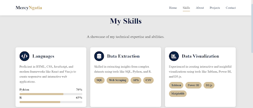
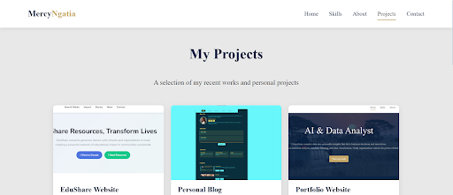
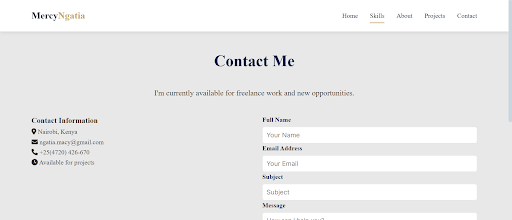

# 🌐 Personal Portfolio Website

This is my final assignment project for the **Multipage Website** module. It demonstrates the use of **HTML5, CSS3, and JavaScript** to build, organize, and deploy a responsive, interactive website that is ready for real-world use.

---

## 🎯 Purpose of the Website

The purpose of this project is to showcase my **skills, projects, and background** in a professional portfolio format. It allows visitors to learn about me, view my past work, and contact me easily.

---

## 📄 Pages & Structure

The website is structured into **five main pages**:

1. **Home (`index.html`)** – Introduction and hero section  
2. **Skills (`skills.html`)** – Showcasing my technical and soft skills  
3. **About (`about.html`)** – Personal background and professional journey  
4. **Projects (`projects.html`)** – Highlighting selected projects  
5. **Contact (`contact.html`)** – A form to get in touch, with form validation  
6. **Thank You (`thank-you.html`)** – Redirect page after successful form submission  

### Navigation
- All pages share a **consistent header and footer**.  
- The **navbar** includes links to every page and a **mobile toggle menu**.  
- Internal navigation highlights the current section as you scroll.  

---

## 🛠️ Features & Technologies

- **HTML5** – Semantic structure for accessibility and SEO  
- **CSS3** – Responsive design, layout, and animations  
- **JavaScript** –  
  - Mobile menu toggle  
  - Active section highlighting while scrolling  
  - Form validation (Contact & Newsletter forms)  
  - Scroll-triggered fade-in animations  
  - Progress bar animations for skills  

---

## 📂 Project Organization

```

project-root/
│
├── index.html
├── about.html
├── skills.html
├── projects.html
├── contact.html
├── thank-you.html
│
├── css/
│   └── style.css
│
├── js/
│   └── script.js
│
├── images/
│   └── (all images used in the project)
│
└── README.md

```

- `css/` – Contains stylesheets  
- `js/` – Contains JavaScript files  
- `images/` – Stores images for projects and layout  

---

## 📱 Responsiveness

- The website is fully **responsive** across mobile, tablet, and desktop devices.  
- The **hamburger menu** ensures smooth navigation on smaller screens.  
- Layouts adapt using **flexbox and media queries**.  

---

## 📸 Screenshots

Here are some previews of the website:

### 🏠 Home Page


### 👤 About Page


### 🛠️ Skills Page


### 💼 Projects Page


### 📩 Contact Page


<<<<<<< HEAD
=======
> *(Sscreenshots stored in `images/screenshots/` folder.)*
>>>>>>> 84c8319eaa10fa8da8599295f665cec5bc81dfd6

---

## 🚀 Deployment

The website is deployed using ** Netlify **.  

🔗 **Live URL:** https://final-project-web-js.netlify.app/ 

<<<<<<< HEAD
=======
🔗 **Live URL:** [https://final-project-web-js.netlify.app/](https://final-project-web-js.netlify.app/)  

>>>>>>> 84c8319eaa10fa8da8599295f665cec5bc81dfd6

---

## ✅ Outcomes

- A multi-page portfolio website that demonstrates:  
  - Clean HTML, CSS, and JS integration  
  - Consistent and accessible design  
  - Interactive and user-friendly features  
  - Proper file organization and best practices  
- Successfully deployed and publicly accessible.  


